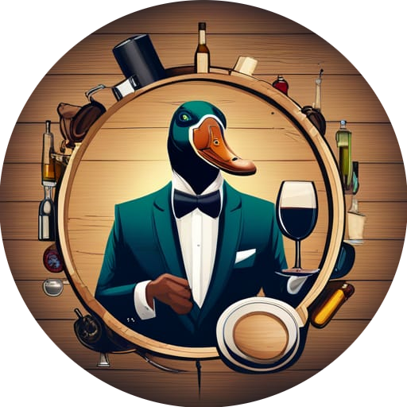
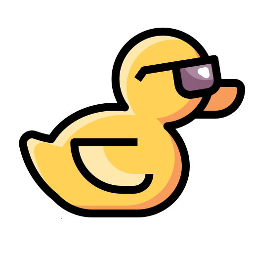
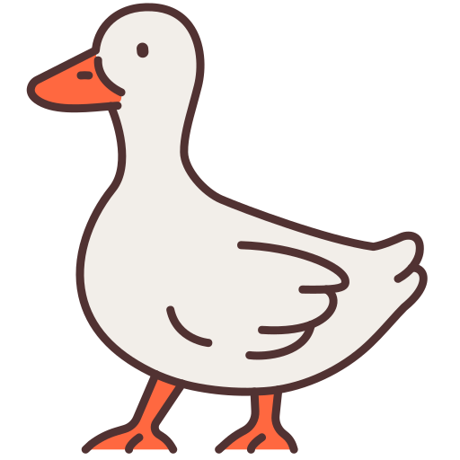
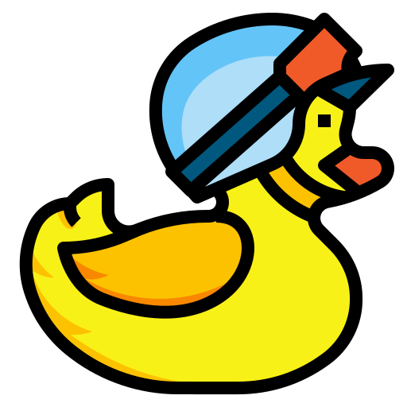
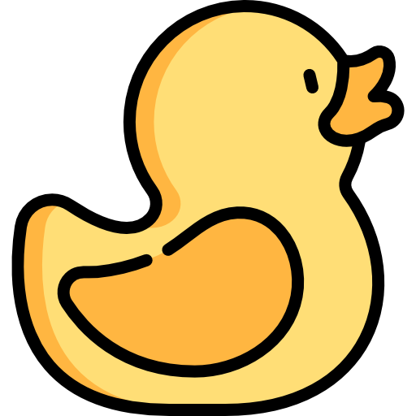

  

<h1 align="center">EL JUEGO DE LA OCA 🎲🐍🦆</h1>

  El Juego de la Oca es una versión digital del popular juego de mesa "La Oca." Este proyecto es una implementación en C++ y Qt de este clásico juego de mesa, que ofrece una experiencia divertida y entretenida para jugadores de todas las edades.

<h2 align="center">Características 😃</h2>

  1) Interfaz gráfica intuitiva y atractiva.

  2) Soporte para múltiples jugadores.

  3) Reglas fieles al juego de mesa original.

  4) Posibilidad de jugar con amigos.

  La temática del juego está ambientada en un emocionante recorrido por un tablero con casillas numeradas, donde los jugadores lanzan un dado y avanzan de acuerdo con el número obtenido. El objetivo es llegar a la casilla final, pero cuidado, ¡pueden surgir sorpresas en el camino que te hagan retroceder!

  Además de las casillas normales, el juego incluye casillas especiales como "La Oca" que te permite avanzar automáticamente a otra casilla "La Oca", y "Puente" que te lleva a una casilla aleatoria del tablero.

  Para hacer el juego aún más emocionante, se han añadido preguntas temáticas que los jugadores deben responder para avanzar o retroceder en el tablero. ¡Demuestra tus conocimientos y llega primero a la casilla final!

<h2 align="center">Instalación 🚀</h2>

  Enlace al instalador

<h2 align="center">Cómo Jugar 🎮</h2>

  Inicia el juego y selecciona el número de jugadores.

  Los jugadores deben tirar los dados y avanzar según el número obtenido.

  Sigue las reglas del juego de la oca original para avanzar en el tablero y ganar. ¡Recuerda que se han añadido preguntas para responder durante el juego para más diversión y desafíos!!!

  Gana el jugador que llegue primero a la casilla final y se corone como el campeón del Juego de la Oca.

<h2 align="center">Contribuciones 🤝</h2>

  Las contribuciones son bienvenidas. Si encuentras algún error o tienes una idea para mejorar el juego, no dudes en hacer un pull request.

<h2 align="center">Licencia 📜</h2>

  Este proyecto está bajo la Licencia GPL-3.0.

<h2 align="center">Autores 👥</h2>

  Felix Navas - @FelixRNV
  Sthalin Chasipanta - @SthalinChasipanta
  Manuel Coyago - @ManuelCoyago

<h2 align="center">Agradecimientos 🙏</h2>

  Agradecemos a la comunidad de programadores de juegos de mesa por su inspiración y recursos compartidos.

  <table align="center">
    <tr>
      <td></td>
      <td></td>
      <td></td>
      <td></td>
    </tr>
    <tr>
      <td align="center">Ficha 1</td>
      <td align="center">Ficha 2</td>
      <td align="center">Ficha 3</td>
      <td align="center">Ficha 4</td>
    </tr>
  </table>

  ¡Diviértete jugando al Juego de la Oca! 🎲🐍🦆

<h3 align="center"><em>THE OCA CORPORATION 1911-2023 🦆</em></h3>

  <em style="font-size: 45%;">in association with</em>

<h3 align="center"><em>Universidad Politecnica Salesiana</em></h3>

  <em>Todos los derechos reservados ©</em>

